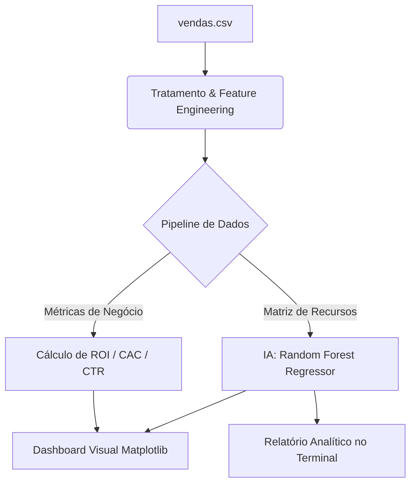

# 📊 Data Science & IA Preditiva para Funil de Vendas


Este projeto consiste em uma plataforma de **Business Intelligence (BI) e Inteligência Artificial de Baixo Nível** desenvolvida para analisar a saúde financeira e a eficiência de funis de marketing digital. A aplicação consome dados históricos corporativos, aplica engenharia de recursos e treina uma IA para prever o faturamento e mapear os principais drivers de crescimento de uma empresa.

---

## 🤵 Autor & Cientista de Dados
* **Diogo** — *Desenvolvedor e Analista de Dados*


---

## 💻 Ambiente de Desenvolvimento

Para garantir total controle de pacotes, estabilidade e uma filosofia de desenvolvimento limpa, este projeto foi construído sob as seguintes especificações:
*   **Sistema Operacional**: [Arch Linux](https://archlinux.org) — Ambiente estável e otimizado via terminal para processamento de scripts de dados.
*   **Editor de Código / IDE**: [VSCodium](https://vscodium.com) — Alternativa de código aberto, livre de telemetria e rastreamento, configurada com ambientes virtuais isolados (`venv`).

---

## 💡 Descrição e Arquitetura do Projeto

O core do projeto foi desenhado para eliminar achismos na tomada de decisões empresariais. Em vez de focar apenas em gráficos descritivos (o que aconteceu), a solução utiliza **Análise Preditiva e Prescritiva** (o que vai acontecer e o que deve ser feito).



### Recursos de Negócio Calculados (Feature Engineering)
O script purifica a base de dados bruta e extrai de forma matemática os seguintes indicadores:
*   **Click-Through Rate (CTR)**: Mede a eficiência dos anúncios visuais.
*   **Taxa de Conversão**: Revela a qualidade do tráfego que chega na ponta final do funil.
*   **Custo de Aquisição de Cliente (CAC)**: Identifica o gasto financeiro exato para conquistar um novo comprador.

---

## 🛠️ Tecnologias e Bibliotecas

*   **Python**: Linguagem base do ecossistema de dados.
*   **Pandas & NumPy**: Vetorização, manipulação de matrizes e tratamento de dados ausentes.
*   **Scikit-Learn**: Pipeline de Machine Learning para treinamento do modelo preditivo e cálculo de métricas de acurácia.
*   **Matplotlib**: Engenharia gráfica para plotagem de subplots limpos e customizados.

---

## ⚙️ Inteligência Artificial Empregada

O modelo utiliza o algoritmo **Random Forest Regressor** (Floresta Aleatória), uma técnica de aprendizado por conjunto (*ensemble learning*). Ele cria múltiplas árvores de decisão aleatórias durante o treino e combina seus resultados para gerar uma predição final de alta precisão.

### Por que esta abordagem é a mais correta?
Diferente de modelos lineares básicos, o Random Forest:
1.  **Não sofre com multicolinearidade**: Avalia o impacto isolado de variáveis que crescem juntas (ex: cliques e visualizações).
2.  **Mapeia relações não-lineares**: Captura variações complexas e sazonalidades sem distorcer o resultado final.
3.  **Avalia a Importância dos Recursos (*Feature Importance*)**: Mede estatisticamente a porcentagem exata de impacto que cada etapa do processo tem no faturamento total da empresa.

---

## 📈 Visualização dos Resultados

A aplicação entrega uma interface dual ao usuário no momento da execução:

### 1. Relatório Textual (Terminal)
Exibe a validação estatística do modelo, garantindo confiabilidade antes da exibição visual.
```text
✅ Dados do CSV carregados com sucesso!

--- RELATÓRIO DE PERFORMANCE DA IA ---
Precisão do Modelo (R²): 0.9931 (99.31%)
Erro Médio Absoluto (MAE): R\$ 142.50

--- PESO DE INFLUÊNCIA NO FATURAMENTO (Descoberto pela IA) ---
-> Vendas_Concluidas: 44.20% de impacto direto no faturamento
-> Cliques_Anuncio: 28.15% de impacto direto no faturamento
-> Investimento_Mkt: 14.10% de impacto direto no faturamento
-> Ticket_Medio: 9.35% de impacto direto no faturamento
-> Visualizacoes_Anuncio: 4.20% de impacto direto no faturamento
------------------------------------------------------------
```

### 2. Painel Visual (Interface Gráfica)
Um dashboard limpo dividido em 4 quadrantes analíticos estratégicos:
*   **Quadrante 1 (Superior Esquerdo)**: Gráfico de dispersão real versus a linha pontilhada de predição da IA.
*   **Quadrante 2 (Superior Direito)**: Gráfico de barras horizontais com as **porcentagens de impacto** de cada recurso com fontes otimizadas para evitar sobreposição.
*   **Quadrante 3 (Inferior Esquerdo)**: Gráfico de linha temporal mapeando a oscilação e maturidade do CAC.
*   **Quadrante 4 (Inferior Direito)**: Histograma de barras comparativo de tráfego do funil (Cliques vs Vendas) exibindo as taxas de conversão de forma flutuante sobre as barras, livre de linhas vermelhas poluentes.

---

## 🚀 Instalação e Execução

### Pré-requisitos
Ter o Python instalado na sua máquina (compatível com Linux Arch, Windows e macOS).

### Instalação
1. Clone este repositório ou crie uma pasta local:
   ```bash
   git clone https://github.com/seu-repositorio.git
   cd seu-repositorio
   ```
2. Instale as dependências via gerenciador de pacotes:
   ```bash
   pip install pandas numpy scikit-learn matplotlib
   ```

### Execução
Garanta que seu arquivo de dados `vendas.csv` está na mesma pasta raiz do script e execute:
```bash
python analise_vendas.py
```
